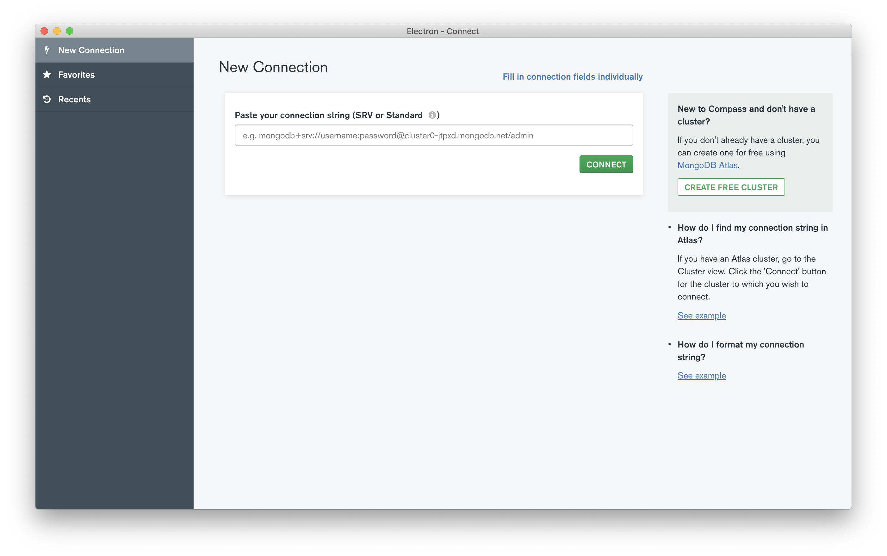
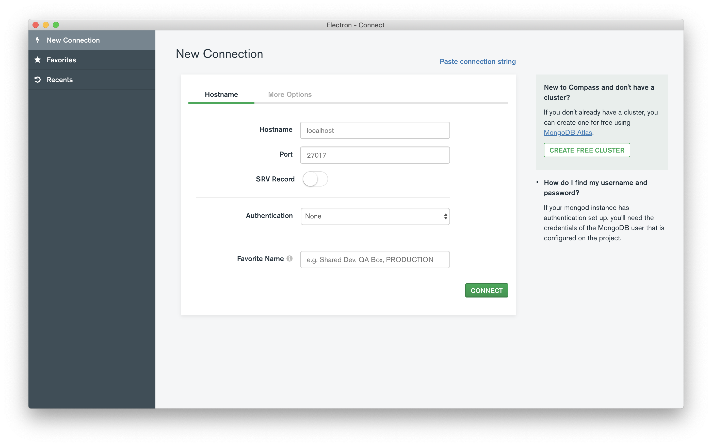

# Compass Connect [![][travis_img]][travis_url]

When you open the MongoDB Compass application, an initial dialog that appears is a connection screen. There are two ways in which you can connect to your desirable database: fill in connection fields manually or connect via a connection string (URI).

## Usage

### Connecting via URI

[A Uniform Resource Identifier (URI)](https://medium.com/r/?url=https%3A%2F%2Ftools.ietf.org%2Fhtml%2Frfc3986) is a compact sequence of characters that identifies an abstract or physical resource.

The standard MongoDB URI connection scheme has the form:

```
mongodb://[username:password@]host1[:port1][,...hostN[:portN]]][/[database][?options]]
```

And includes the following components:

`mongodb://` -  A required prefix to identify that this is a string in the standard MongoDB connection format.

`username:password@` - Optional authentication credentials. If specified, the client will attempt to log in to the specific database using these credentials after connecting.

`host[:port]` - The host (and optional port number) where the [mongod](https://medium.com/r/?url=https%3A%2F%2Fdocs.mongodb.com%2Fmanual%2Freference%2Fprogram%2Fmongod%2F%23bin.mongod) instance (or the [mongos](https://medium.com/r/?url=https%3A%2F%2Fdocs.mongodb.com%2Fmanual%2Freference%2Fprogram%2Fmongos%2F%23bin.mongos) instance for a sharded cluster) is running. You can specify a hostname, IP address, or UNIX domain socket. It can contain as many hosts as appropriate for your deployment topology.

`/database` - The optional name of the database to authenticate if the connection string includes authentication credentials in the form of `username:password@`.

`?<options>` - The optional query string that specifies [connection string options](https://medium.com/r/?url=https%3A%2F%2Fdocs.mongodb.com%2Fmanual%2Freference%2Fconnection-string%2F%23connections-connection-options) as `<name>=<value>` pairs.

Here is some example of MongoDB URI:
mongodb://

```
myDBReader:P%40ssw0rd@mongodb0.example.com:27017/admin?replicaSet=myRepl
```



### Connecting via the form

Users can switch to the form view by clicking `"Fill in connection fields individually"` on the top right corner of the screen. The connection form attributes were split into `"Hostname"` and `"More options"` view. On the first view users can enter a hostname, port, indicate whether it is SRV record or regular one and specify the authentication mechanism. On the second view, a request can be decorated with additional connection options such as read preference, SSL method or SSH tunnel.



## License

Apache 2.0

[travis_img]: https://travis-ci.com/10gen/compass-connect.svg?token=ezEB2TnpPiu7XLo6ByZp&branch=master
[travis_url]: https://travis-ci.com/10gen/compass-connect
[npm_img]: https://img.shields.io/npm/v/@mongodb-js/compass-connect.svg?style=flat-square
[npm_url]: https://www.npmjs.org/package/@mongodb-js/compass-connect
